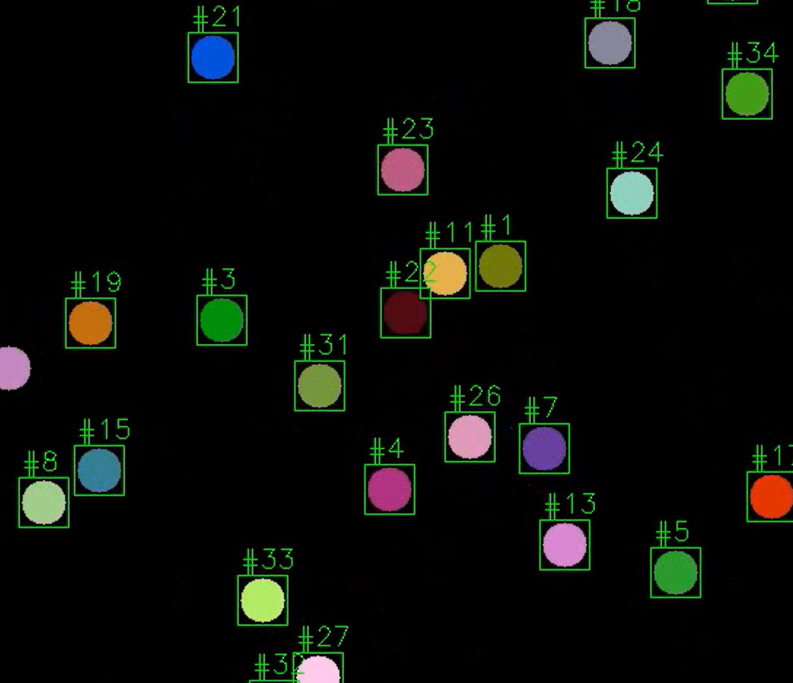

# Particle Tracking with Template Matching

An educational application demonstrating real-time **particle tracking** using **OpenCV template matching** with rolling template updates. The project includes a synthetic particle simulator and a frame-by-frame tracker that assigns persistent IDs to moving objects.



---

## Table of Contents

- [Overview](#overview)
- [How It Works](#how-it-works)
  - [Stage 1 -- Particle Simulation](#stage-1----particle-simulation)
  - [Stage 2 -- Template Matching Tracker](#stage-2----template-matching-tracker)
- [Algorithm Deep Dive](#algorithm-deep-dive)
  - [Template Matching with `cv2.matchTemplate`](#template-matching-with-cv2matchtemplate)
  - [Normalised Cross-Correlation (`TM_CCOEFF_NORMED`)](#normalised-cross-correlation-tm_ccoeff_normed)
  - [Rolling Template Update](#rolling-template-update)
  - [Local Search with Circular Masking](#local-search-with-circular-masking)
  - [New Particle Detection via Greedy Suppression](#new-particle-detection-via-greedy-suppression)
  - [Track Lifecycle Management](#track-lifecycle-management)
- [Project Structure](#project-structure)
- [Installation](#installation)
- [Usage](#usage)
- [Configuration](#configuration)
- [Limitations and Future Work](#limitations-and-future-work)
- [License](#license)

---

## Overview

This project tackles a fundamental problem in computer vision: **tracking multiple objects across video frames** without relying on deep learning. Instead, it uses classical template matching -- a technique where a small image patch (the *template*) is slid across each frame to find the best match.

The pipeline is split into two independent stages:

1. **Simulation**: Generates a synthetic video of coloured circular particles performing random walks on a black canvas.
2. **Tracking**: Reads the video back and tracks each particle using per-particle rolling templates, assigning a unique numeric ID to every tracked object.

---

## How It Works

### Stage 1 -- Particle Simulation

The simulator creates a 600x600 pixel black canvas and spawns particles at random positions along the four edges. Each particle is a filled circle with a random BGR colour and a fixed radius (15 px by default).

**Spawning rules:**

- A particle's spawn edge is chosen uniformly at random (top, bottom, left, right).
- The spawn position is resampled if the new particle's centre would be within a minimum distance (`MIN_CENTER_DIST = 28 px`) of any existing particle's centre, preventing overlapping spawns.

**Movement model (directional random walk):**

Each particle moves in discrete steps whose direction is biased by the spawning edge:

| Spawn edge | Allowed angle range | Bias direction |
|------------|-------------------|----------------|
| Bottom     | 0 -- 180          | Upward         |
| Top        | 180 -- 360        | Downward       |
| Left       | -90 -- 90         | Rightward      |
| Right      | 90 -- 270         | Leftward       |

The step length equals the particle's radius. Before committing a move, the simulator checks that the new centre does not violate the minimum distance constraint with respect to all other particles. If it does, the move is resampled up to 40 times; if no valid move is found, the particle stays put.

**Termination:**

Particles are removed from the simulation when their centres leave the frame boundaries. The simulation ends once all 80 particles have been created and have either left the frame or been removed.

### Stage 2 -- Template Matching Tracker

The tracker processes the simulation video frame by frame. On each frame, it performs three phases:

**Phase A -- Track existing particles:**

For every active track, the tracker performs a **local template match** around the particle's last known position. The search is restricted to a circular region of radius `SEARCH_RADIUS = 16 px`. Only the best match *within* this circle is considered. If the match score exceeds `TRACK_MIN_SCORE = 0.7`, the track is updated; otherwise, the track is terminated.

**Phase B -- Mask tracked regions:**

Before looking for new particles, the tracker paints black circles over all fully-formed tracks in a copy of the frame. This prevents the new-particle detector from re-detecting objects that are already being tracked.

**Phase C -- Detect new particles:**

A **vanilla template** (a plain white circle) is matched against the masked frame using a global `cv2.matchTemplate` call. If the best match exceeds `NEW_MIN_SCORE = 0.35`, a new track is initialised at that location. The region is then masked out, and detection repeats up to `MAX_NEW_PER_FRAME` times.

---

## Algorithm Deep Dive

### Template Matching with `cv2.matchTemplate`

Template matching slides a small template image `T` of size `(w, h)` across a larger image `I` and computes a similarity score at every position. The result is a 2D score map `R` where:

```
R(x, y) = similarity(I[y:y+h, x:x+w], T)
```

The location of the maximum value in `R` indicates the best match.

### Normalised Cross-Correlation (`TM_CCOEFF_NORMED`)

This project uses `cv2.TM_CCOEFF_NORMED` as the matching method. It computes the **zero-mean normalised cross-correlation**:

```
R(x, y) = sum[ (T'(x', y') * I'(x+x', y+y')) ]
           / sqrt( sum[T'(x', y')^2] * sum[I'(x+x', y+y')^2] )
```

where `T'` and `I'` are the mean-subtracted template and image patch respectively.

**Key properties:**

- **Output range**: [-1, 1], where 1 indicates a perfect match.
- **Illumination invariant**: Subtracting the mean makes it robust to uniform brightness changes.
- **Scale**: The normalisation ensures scores are comparable across different regions of the image.

### Rolling Template Update

A critical design choice in this tracker is the **rolling template**. Instead of matching against a fixed template for the entire video, each track refreshes its template every frame from the actual pixel content of the matched region:

```
After matching particle #5 at position (cx, cy) in frame t:
  track[5].template = extract_particle_only_template(frame_t, cx, cy)
```

This makes the tracker robust to:

- **Colour drift** (in real-world scenarios where lighting changes).
- **Partial occlusion recovery** (the template adapts to the current visible appearance).
- **Shape deformation** (for non-rigid objects).

The template extraction uses a **circular mask** to isolate only the particle pixels, setting the background to black. This prevents the template from learning background texture that would hurt matching in later frames.

### Local Search with Circular Masking

Instead of running `matchTemplate` over the entire frame (which would be O(W * H) per track), the tracker crops a small **region of interest (ROI)** around the particle's last known position:

```
ROI = frame[cy - search_r - h/2 : cy + search_r + h/2,
            cx - search_r - w/2 : cx + search_r + w/2]
```

Within this ROI, the correlation map is further restricted to a **circular mask** of radius `SEARCH_RADIUS`. This is essential because it:

1. **Limits drift**: A particle cannot "jump" to a nearby look-alike that is outside the search radius.
2. **Reduces computation**: The ROI is much smaller than the full frame.
3. **Prevents identity swaps**: When two particles pass close to each other, the circular constraint keeps each track locked to its own particle.

### New Particle Detection via Greedy Suppression

New particles are detected using a **greedy iterative approach**:

1. Run `matchTemplate` with the vanilla circle template on the masked frame.
2. If the best score exceeds `NEW_MIN_SCORE`, create a new track at that location.
3. Paint a black circle over the detected region (non-maximum suppression).
4. Repeat up to `MAX_NEW_PER_FRAME` times.

This greedy suppression is simpler than classical non-maximum suppression (NMS) with IoU thresholds, but works well because:

- Particles have a known fixed size.
- Painting the mask ensures the exact same region is not detected again.
- Limiting to one new detection per frame avoids false positives from noisy correlation peaks.

### Track Lifecycle Management

Each track goes through three stages:

| Stage | Condition | Behaviour |
|-------|-----------|-----------|
| **Birth** | Vanilla template match > `NEW_MIN_SCORE` and not near edge | Track created, rolling template initialised |
| **Active** | Rolling template match > `TRACK_MIN_SCORE` and not near edge | Position and template updated each frame |
| **Death** | Score below threshold, or centre moves near frame edge | Track deleted, ID recycled for future use |

Track IDs are recycled using a LIFO (last-in-first-out) free list. When a track dies, its ID is pushed onto the free list. The next new detection pops from this list before allocating a fresh ID. This keeps IDs compact and avoids unbounded ID growth in long videos.

---

## Project Structure

```
particle-tracking-with-template-matching/
|-- README.md                   # This file
|-- requirements.txt            # Python dependencies
|-- images/
|   |-- circle_template.png     # Sample vanilla circle template
|   |-- particle_tracker_shot.png  # Screenshot of tracker in action
|-- notebooks/
|   |-- particle_tracker.ipynb  # Interactive notebook (simulation + tracking)
|-- src/
|   |-- __init__.py             # Package exports
|   |-- simulation.py           # Particle simulation engine
|   |-- tracker.py              # Template matching tracker
|   |-- visualization.py        # Drawing and overlay utilities
```

### Module Descriptions

| Module | Purpose |
|--------|---------|
| `src/simulation.py` | Particle spawning, random-walk movement, collision avoidance, frame rendering, and video output. |
| `src/tracker.py` | Rolling-template tracker: local search, circular mask matching, new detection, track lifecycle, and the `run_tracker()` high-level function. |
| `src/visualization.py` | Bounding box and track ID overlay functions for annotating frames. |

---

## Installation

```bash
# Clone the repository
git clone https://github.com/<your-username>/particle-tracking-with-template-matching.git
cd particle-tracking-with-template-matching

# Install dependencies
pip install -r requirements.txt
```

### Requirements

- Python 3.8+
- NumPy >= 1.21
- OpenCV (opencv-python) >= 4.5
- Matplotlib >= 3.4

---

## Usage

### Run via the notebook (recommended)

```bash
cd notebooks
jupyter notebook particle_tracker.ipynb
```

The notebook walks through both the simulation and tracking stages interactively, with inline visualisations.

### Run programmatically

```python
from src.simulation import simulate_particles
from src.tracker import run_tracker

# Step 1: Generate simulation video
total_data = simulate_particles(
    output_path="simulation_detection.mp4",
    frame_width=600,
    frame_height=600,
    max_particles=80,
)

# Step 2: Track particles in the generated video
final_tracks = run_tracker(
    video_path="simulation_detection.mp4",
    output_path="simulation_tracking.mp4",
)
```

---

## Configuration

All key parameters have sensible defaults but can be tuned:

### Simulation Parameters

| Parameter | Default | Description |
|-----------|---------|-------------|
| `frame_width` | 600 | Canvas width in pixels |
| `frame_height` | 600 | Canvas height in pixels |
| `max_particles` | 80 | Total particles to spawn over the simulation |
| `min_center_dist` | 28 | Minimum distance between particle centres (pixels) |
| `fps` | 15.0 | Output video frame rate |

### Tracker Parameters

| Parameter | Default | Description |
|-----------|---------|-------------|
| `template_size` | 30 | Side length of the square template patch |
| `mask_radius` | 15 | Radius for circular template masking |
| `search_radius` | 16 | Maximum search distance from previous position |
| `new_min_score` | 0.35 | Minimum NCC score to accept a new detection |
| `track_min_score` | 0.7 | Minimum NCC score to maintain an existing track |
| `max_new_per_frame` | 1 | Maximum new detections per frame |

### Tuning Tips

- **Increase `search_radius`** if particles move faster than ~15 px/frame and tracks are being lost.
- **Decrease `track_min_score`** if particles change appearance significantly between frames (e.g. due to occlusion).
- **Increase `new_min_score`** if you see false-positive detections in noisy regions.
- **Increase `max_new_per_frame`** if many particles enter the frame simultaneously.

---

## Limitations and Future Work

**Current limitations:**

- **Fixed circular shape assumption**: The tracker uses circular masks and templates. Non-circular or deformable objects would need a different masking strategy.
- **No occlusion handling**: When two particles overlap, the tracker may lose one or swap their identities. A more robust approach would incorporate motion prediction (e.g. Kalman filtering).
- **No re-identification**: Once a track is lost, there is no mechanism to re-associate it if the particle reappears. Appearance-based re-ID could address this.
- **Single-scale matching**: The template size is fixed. Multi-scale template matching would handle particles at varying distances from the camera.

**Possible extensions:**

- Add a **Kalman filter** for motion prediction, improving tracking through brief occlusions.
- Implement **Hungarian algorithm** assignment for globally optimal track-to-detection matching.
- Support **multi-scale templates** for varying particle sizes.
- Replace the vanilla circle template with a **learned detector** (e.g. a small CNN) for more complex particle shapes.

---

## License

This project is provided for educational purposes.
